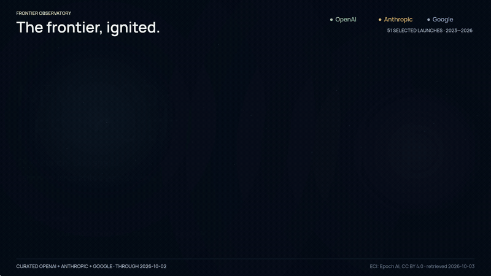

# Frontier Model Release Timeline

[](https://github.com/crosscore/frontier-model-release-timeline/actions/workflows/ci.yml)

Frontier AIモデルの発表が重なっていく様子を、編集可能なJSONから動画にするローカル生成ツールです。OpenAI / Anthropicの**39件の選定イベント（2023-01-01〜2026-10-02）**を、公式出典付きで収録しています。業界全体を網羅したデータではありません。

[横長MP4](https://github.com/crosscore/frontier-model-release-timeline/raw/refs/heads/main/preview/frontier-landscape.mp4) · [縦長MP4](https://github.com/crosscore/frontier-model-release-timeline/raw/refs/heads/main/preview/frontier-portrait.mp4) · [全出典CSV](preview/sources.csv) · [集計方法](docs/methodology.md)



GIFは無音・8fpsの見本です。BGMと滑らかな動きは上のMP4から確認できます。

約56秒、30fps、オリジナルBGM・打上げ音付き。横長1920×1080と縦長1080×1920のMP4、GIF、ポスター、英語字幕、出典一覧ページを同梱しています。映像は英語、操作手順は日本語です。

## 再生成

Node.js 22以上と、H.264エンコーダーを含むFFmpegが必要です。Macでは `brew install node ffmpeg` で導入できます。APIキー・有料API・ブラウザ自動化は不要です。初回の依存取得後はオフラインで描画できます。

```bash
git clone https://github.com/crosscore/frontier-model-release-timeline.git
cd frontier-model-release-timeline
npm ci --ignore-scripts
npm test
npm run build
npm run render
npm run render -- --format portrait
npm run verify:media
npm run verify:media -- --format portrait
npm run preview
```

`http://127.0.0.1:4173` で動画と出典一覧を開きます。`build` は静止画・一覧を準備し、`render` が動画を生成します。生成先はGit管理外の `dist/` です。音も毎回ローカルで合成・マスタリングします。保存済み動画をすぐ見る場合は `npm run preview -- --out preview` を使用してください。プレビューは自動再生しません。

```bash
# 軽量版（3秒に圧縮した動作確認用。共有用には通常の長さを推奨）
npm run render -- --width 640 --fps 10 --duration 3 --no-gif

# 別のデータ・出力先、縦長720p
npm run render -- --data data/releases.json --out output --format portrait --width 720

# 同梱プレビューを更新する場合
npm run build -- --out preview
npm run render -- --out preview
npm run render -- --out preview --format portrait
```

## データを更新

1. [data/releases.json](data/releases.json) の `releases` に日付順で追加します。`sources` には公式発表または公式リリースノートのHTTPS URLを入れます。
2. 同じ会社・同じ日の同時発表は1件にまとめます。プレビューは `stage: "preview"` で明示します。
3. [選定ルール](docs/methodology.md) に照らして対象を確認し、必要に応じて `endDate` と `verifiedOn` を更新します。
4. `npm run validate && npm test` を実行してから再生成します。日付の正しさ・採否の判断は人が一次情報で確認してください。CIは出典本文の自動事実確認を行いません。

最小イベント例（既存行を編集する形で利用）:

```json
{
  "id": "openai-gpt-4",
  "date": "2023-03-14",
  "lab": "openai",
  "name": "GPT-4",
  "stage": "release",
  "sources": [{
    "url": "https://openai.com/index/gpt-4-research/",
    "title": "GPT-4 — official announcement"
  }]
}
```

## 映像の読み方

- 1つの開花＝1件の選定イベント。日付は一定速度で進み、開花と破裂音が公開日の時刻に一致します。上昇は0.46秒前から始まります。
- 地平線の点が発表日の正確な位置です。各年を同じ1月〜12月の幅で表示します。開花の横位置は端や同日の重なりを避けるため少し移動します。
- MintがOpenAI、AmberがAnthropic。半径・粒子数・寿命は全発表で同じです。近い発表の開花位置は上下左右に分けますが、高さは性能を表しません。プレビューはモデル名の `*` と中空の地上マークで区別します。
- 会社ごとの4つの固定スロットにモデル名を最低2秒残します。新着は最古のスロットを置換するので、表示順は循環します。縦長はOpus/Sonnet/Fableの前のClaude接頭辞を省略します（Claude 2等の数字だけの名前は維持）。全正式名は字幕と出典一覧に残ります。
- 最後の棒グラフは **観測日数 ÷ 選定イベント数**。平均発表間隔や開発期間とは異なります。2026年は275日分の途中集計です。

このデータでは年ごとに **73.0 / 61.0 / 33.2 / 16.2日／件** となります。数値は描画時に計算され、選定を変えると結果も変わります。参考投稿の「18日」はコピーしていません。

## 構成と検証

| パス | 役割 |
| --- | --- |
| `data/releases.json` | 更新する原本。日付・モデル名・注記・一次出典 |
| `src/data.mjs` | データ検証、UTC日付処理、年別集計 |
| `src/timeline.mjs` | 等速の再生時計と正確な開花時刻 |
| `src/audio.mjs` | オリジナル楽曲・発表効果音の決定的な合成 |
| `src/draw.mjs` | 2つのアスペクト比の独自Canvasデザイン |
| `scripts/` | ビルド、FFmpeg出力、動画検証、ローカル表示 |
| `preview/` | 生成済みMP4・GIF・字幕・ポスター・出典一覧 |
| `test/` | 集計、境界日、同時発表、文字のはみ出し、決定性のテスト |

CIはmacOS / Linuxでテスト・ビルドし、Linuxでは横長・縦長を実際にH.264へエンコードして音声付きで全フレームをデコードします。`manifest-*.json` と動画の寸法・フレーム数・長さ・原本JSONのSHA-256を照合します。音声のLUFS・True Peak・LRAも最終MP4から計測し、音圧や無音・クリッピングの問題を検出します。動画のバイト列はFFmpegやOSのバージョンにより変わり得ます。

## オリジナルBGM

**Afterglow / 001** — 100 BPMの電子音楽。温かなパッド、アルペジオ、ベース、軽いパーカッションと、発表日に同期する上昇音・柔らかな破裂音を、正弦波とseed付きノイズから合成します。テンポ・発音パターンを後半だけ増やさず、発表の密度はデータから伝えます。

[音声だけを再生・保存](preview/soundtrack-landscape.m4a) · [合成方法と権利](docs/audio.md) · [音圧・同期時刻](preview/audio-landscape.json) · [デザイン監査記録](docs/design-review.md)

既存曲・録音サンプル・音楽生成サービス・課金APIは使用していません。コード・生成曲・効果音はMITライセンスです。最終AACは約−18 LUFSで控えめにマスタリングしています。Claudeによる監査は画像・ソース・音響計測が対象で、人間の耳による試聴合格を意味しません。

## 参考とライセンス

[MoniiiiのX投稿](https://x.com/miniii_codes/status/2103938407558947265)を実際に確認し、日付の密度が増していく着想を参考にしました。確認内容・独自化した点は [docs/reference.md](docs/reference.md) に記載しています。元動画・画像・音声・ロゴは含めていません。

生成コード・独自グラフィック・オリジナル音楽と効果音は [MIT](LICENSE)。同梱のManropeは [SIL Open Font License](assets/fonts/OFL.txt) です。[フォントの取得元](assets/fonts/README.md)を参照してください。リンク先の発表記事は各権利者に帰属します。
